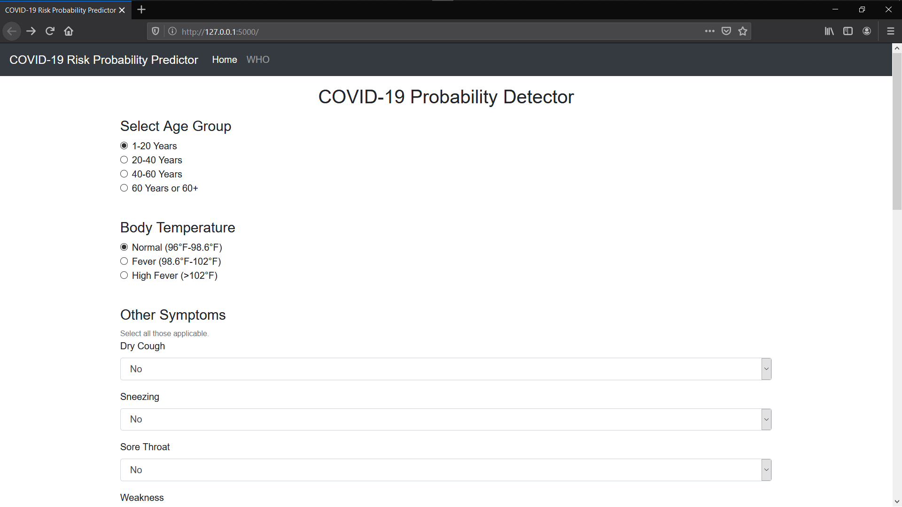
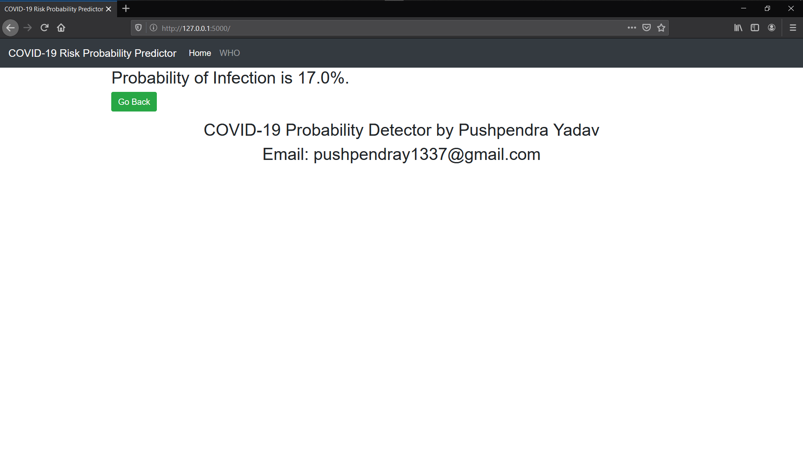

# COVID-19 Probability Detector
> This is a simple web application detects probability of COVID-19 infection by analyzing symptoms of a person.

## Table of contents
* [General info](#general-info)
* [Screenshots](#screenshots)
* [Technologies](#technologies)
* [Setup](#setup)
* [Features](#features)
* [Status](#status)
* [Contact](#contact)
* [Authors and Contributers](#authors-and-contributers) 
* [License](#license)

## General info
>This application detects probability of COVID-19 infection in a person by analyzing symptoms.

### Purpose
>COVID-19 tests are limited in daily basis thus everybody could not be tested in single day ***so this application could be very useful for medical authorities or medical professionals for prioritization of COVID-19 test cases.***

## Screenshots

## Technologies
* [Python](https://www.python.org/)
* [Bootstrap](https://getbootstrap.com/)
* [Flask](http://flask.pocoo.org/)
* [Pandas](https://pandas.pydata.org/)
* [Numpy](https://numpy.org/)
* [Scikit-learn](https://scikit-learn.org/stable/)

### Important

>**THIS PROJECT IS BASED UPON SELF CREATED DATASET OF SYMPTOMS and LOGISTIC REGRESSION**.
>***This project can be enhanced by using dataset provided by medical authorities.***

## Setup

### Prerequisites

This application uses many external modules so before setting up this application in your local machine you need to install these softwares and modules.  

#### Install Python
Go to https://www.python.org/downloads/ , select OS and download the installer. Then run the installer, proceed further and finish the installation.

#### Install Flask
To install flask run your terminal with administrative priviliges and run following command.-
`$ pip install flask`

### Deployment in Local Machine
To start this application open terminal in application directory and run following command.-
`$ python app.py`
After this a URL will be displayed in terminal window, after typing that URL into browser window web apllication will start.

### Deployment in Live Server
I could not figure out how to deploy this application in live environment. If anyone knows how to deploy this application in live server please help me with this issue. ***Credit will be given to you after successful deployment***.

## Features
* Clean UI
* Useful for self assessment
* Very useful for Doctors and Medical authorities

To-do list:
* Live map with active and recovered cases.
* Many more improvements.

## Status
Project is: _in progress_

## Contact
Created by ***Pushpendra Yadav***
Email - (pushpendray1337@gmail.com)
Instagram - [https://instagram.com/sinister_._._]
Feel free to contact me!

## Authors and Contributers

* **Pushpendra Yadav** - *Initial work* - [COVID-19 Probability Detector](https://github.com/pushpendra1337)

Anyone can help us by suggesting the new improvements and features.
>**I truly ❤️ pull requests!**
>See also the list of [contributors](https://github.com/pushpendra1337/contributors/) who participated in this project.

## License

This project is licensed under the MIT License - see the [LICENSE.md](LICENSE.md) file for details.
